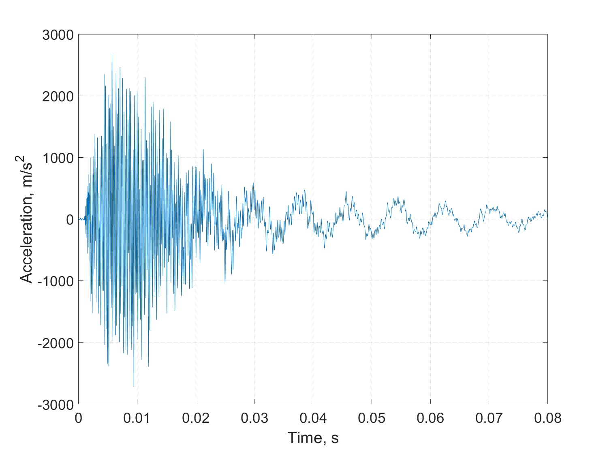
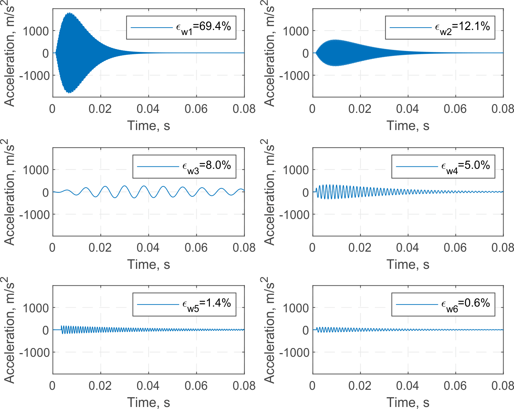
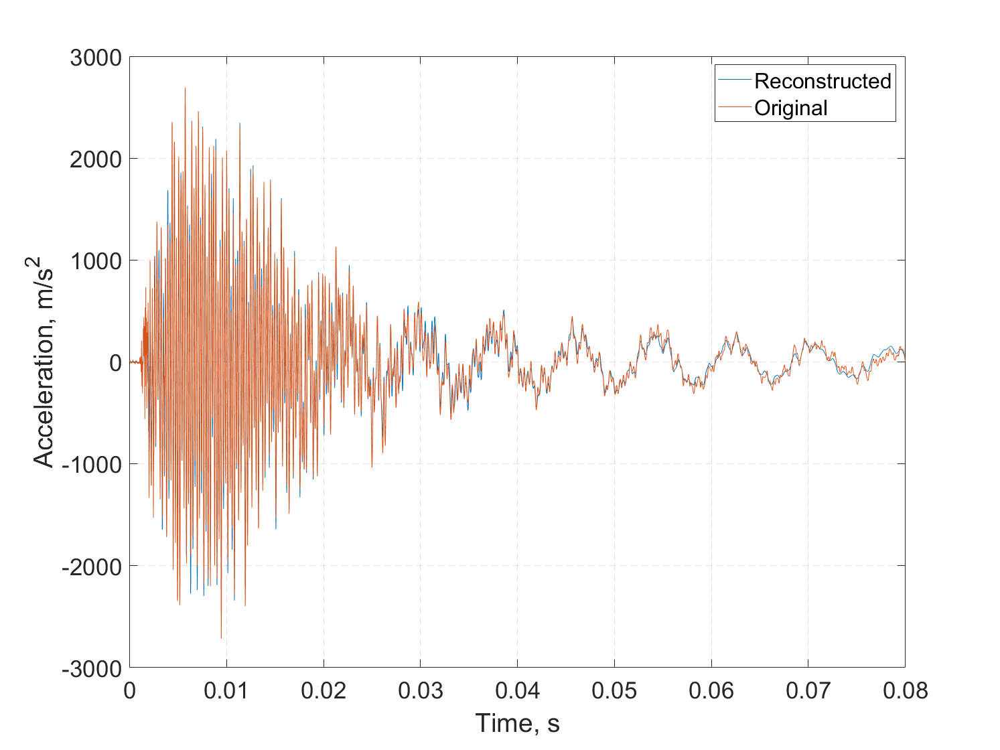

# Shock Waveform Decomposition Method
Code for the paper entitled "A general shock waveform and characterisation method".
This algorithm can decompose a mechanical shock measurement into several shock waveform components.
The method was keeping improved and debugged even after article acceptance.
Therefore the results coming from this algorithm may be slightly different from the results shown in the paper, although the algorithms are essentially the same.
Please read [the paper](https://www.sciencedirect.com/science/article/pii/S0888327019307290?via%3Dihub) for more details.

## Disclaimer
This software is published for academic and non-commercial use only.

## Usage
There are two classes in this repository.

The 'acc' class contains time and data information within its properties that describes an acceleration measurement.
It is a subclass of 'timeseries' class, so all methods in 'timeseries' class can be directly applied.
It also provide some overloaded simple function, such as FFT, plot, and bandpass filter, which can be directly use to analyse mechanical shock signals.
Helps can be accessed by `help acc` in MATLAB's command window.

>A collection of methods dealing with acceleration time history signal of mechanical shocks. This class is written as a subclass of 'timeseries' class, so all 'timeseries' methods can also be used.
>
> acc Properties:  
>    Sf - Sample rate  
>    Time - Time column  
>    Data - Measured acceleration data column  
>    Length - Length of time series
>
>acc Methods:  
>    acc - Constructor method to create a acc object.  
>    resample1 - Resample a time series.  
>    bandpass - A bandpass filter.  
>    plot - An overload plot function for acc object.  
>    fft - An overload fast Fourier transform function for acc object.  
>    fit - Shock waveform decomposition method.  
>    cwt - An overload continues wavelet transform plot.  
>    dwt - An overload discrete wavelet transform plot.  
>    cumtraapz - Overload numerical integration.  
>    diff - Overload numerical difference.  
>    extend - Extending the time series for a certain period.

The 'acc.fit' method is for shock waveform decomposition.
Once the 'acc.fit' completes successfully, the decomposed results will be in the form of an 'swd' object.
Specifically, the 'swd' is a class to post-process and visualize shock waveform components.

## Example

Consider a provided mechanical shock signal directly measured from an accelerometer.
Import the provided data and construct an 'acc' object.
Use provided pre-processing methods to detrend, capture, align, resample and view the measurement signal.

```
load('measurement.mat');
shock = acc([t,y]);
shock = shock.detrend('constant');
shock = shock.getsampleusingtime(0.019, 0.099);
shock.Time = shock.Time - shock.Time(1);
shock = shock. resample1(4000);
shock.plot;
```



Decompose the measurement into shock waveform components with 'acc.fit' method.
Help for specific methods, e.g. 'acc.fit', can be accessed by `help acc.fit`, for example.

> SWD=fit(Acc, Name, Value) returns the object of shock waveform decomposition results.
> Optional name-value pair arguments can be added.
>
> Name-Value Pairs:  
>    'FreSpace' - Spacing of frequencies start points;  
>    2 (default) | Positive scalar  
>    'IniTim' - Start point of initial time.  
>    0 (default) | Row vector  
>    'TauLoc' - Start points of peak times.  
>    [0.6,1,1.4] (default) | Row vector  
>    'TwoWay' - Whether consider the situation with negative
>    peak time. '0' for 'No', and '1' for 'Yes'.  
>    0 (default) | 1  
>    'ErrTol' - The tolerance of error energy ratio.  
>    0.1 (default) | Scalar between (0, 1)  
>    'MinSW' - Minimum shock waveform components  
>    5 (default) | Positive scalar  
>    'XiList' - Start points of damping ratios.  
>    logspace(-2,1,4) (default) | row vector  
>    'PhiNum' - How many start points considered for phase.  
>    2 (default) | Positive scalar  

There are many parameters that can control the performance of the decomposition algorithm, by adjusting starting points.
Instructions for the algorithm should be given in the form of name-value pairs, as explained in the help documents.
Detail explanations for choosing these parameters can be found in section 3 in the paper.
In this example, we can use default parameters without giving any name-value pairs.
```
results = shock.fit;
```
Best objective function values will be plotted during the operation of algorithm.
This process may take several minutes in a common desktop PC.
The shock waveform components 'results' will be returned in as a 'swd' object.
The 'swd' object provide several methods for the post-processing of shock wavefrom components.
A table can be created to view all parameter of decomposed wavefroms.
```
tab = results.table;
```

| Amplitude | Frequency_Hz | t0_ms | tau_ms | zeta | varphi | epsilon | kappa |
|-----|-----|-----|-----|-----|-----|-----|-----|
| 1803.5| 4436.9 | 1.121 | 5.747 | 0.008 | 3.452 | 69.429 | 25.497 |
| 587.34 | 2829.4 | 1.207 | 8.189 | 0.007 | 1.548 | 12.089 | 23.169 |
| 272.58 | 123.4 | 0 | 32.082 | 0.053 | 1.94 | 8.008 | 3.959 |
| 320.94 | 702.53 | 1.32 | 5.116 | 0.011 | 5.839 | 5.005 | 3.594 |
| 180.78 | 998.75 | 3.521 | 0.089 | 0.004 | 6.13 | 1.379 | 0.089 |
| 113.57 | 837.92 | 1.56 | 1.939 | 0.007 | 5.55 | 0.558 | 1.624 |

Plot of each individual shock waveform component can also be viewed in a subplot environment.

```
results.subplot;
```


Reconstruct a signal with these decomposed shock waveform components, and compare it to the original shock measurement.
```
reconstructed = results.yhat;
reconstructed.plot;
hold on;
plot(shock.Time, shock.Data);
legend('Reconstructed', 'Original');
```


## Citation
If you find this study useful for your research, please cite:
```
@article{yan2020general,
  title={A general shock waveform and characterisation method},
  author={Yan, Yinzhong and Li, QM},
  journal={Mechanical Systems and Signal Processing},
  volume={136},
  pages={106508},
  year={2020},
}
```

## Contact
Feel free to contact me at [yinzhong.yan@manchester.ac.uk](mailto:yinzhong.yan@manchester.ac.uk).
